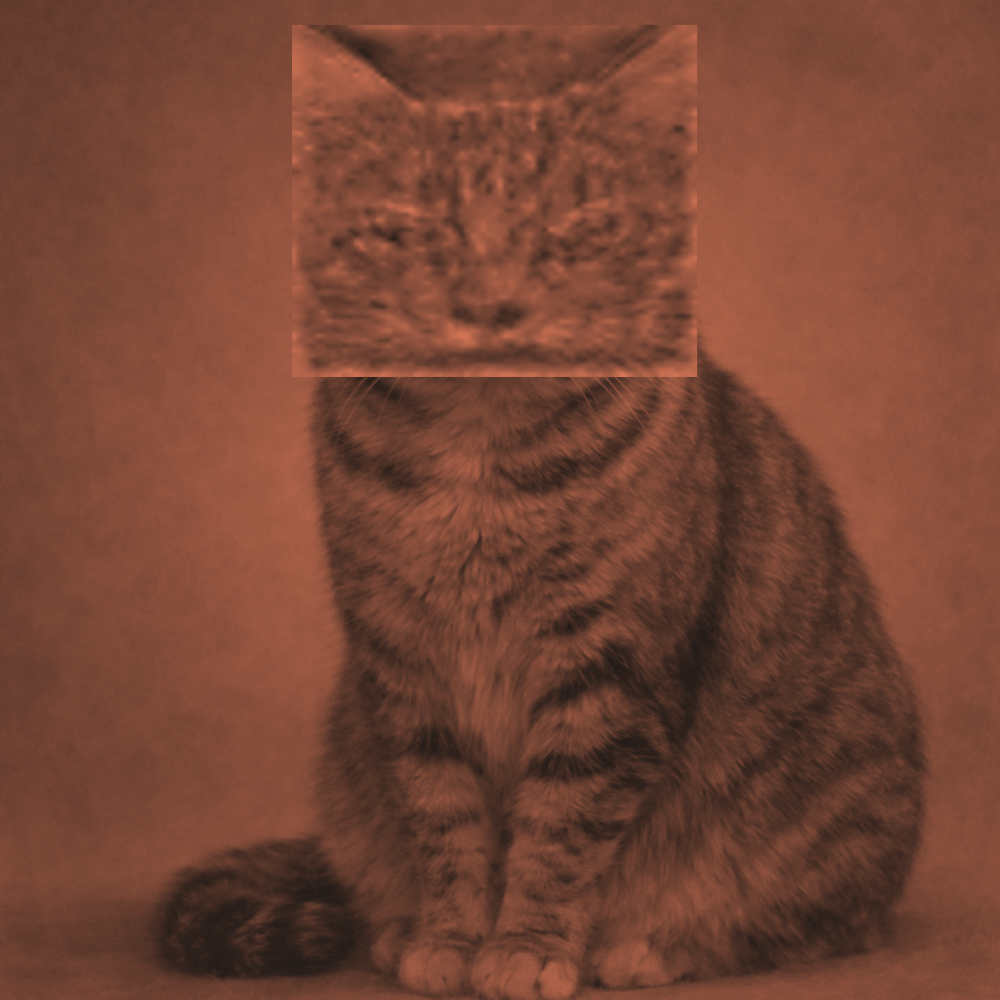
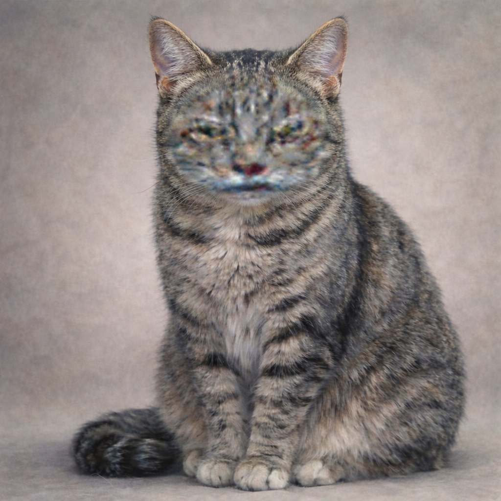

# Claude Color Filter (Orange)

A Python tool that transforms an image into a claude art composition




## Requirements

```
Pillow
numpy
```

Install with:

```bash
pip install Pillow numpy
```

## Usage

Place `Google_Tabby_Cat2b.png` (or your own source image) in the same directory as the script, then run:

```bash
# 全24フィルター一括適用（./output/に保存）
python claude_orange_filter.py my_image.png

# 出力先を指定
python claude_orange_filter.py my_image.png -o ./claude_art

# 特定のフィルターだけ選んで適用
python claude_orange_filter.py my_image.png -f duo_dark soft_medium tint_strong

# フィルター一覧を確認
python claude_orange_filter.py --list
```

Output is saved to the current directory "output" folder.

Eiji Watanabe   
National Institute for Basic Biology, Japan

## Enjoy !!!



